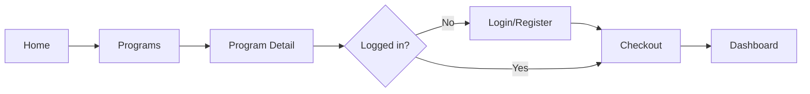
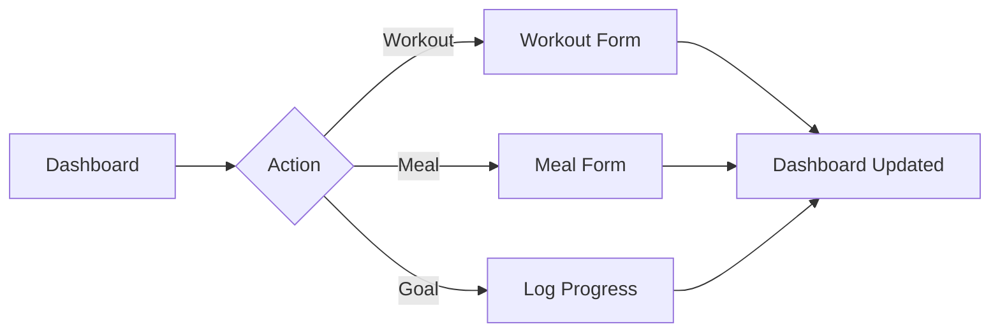
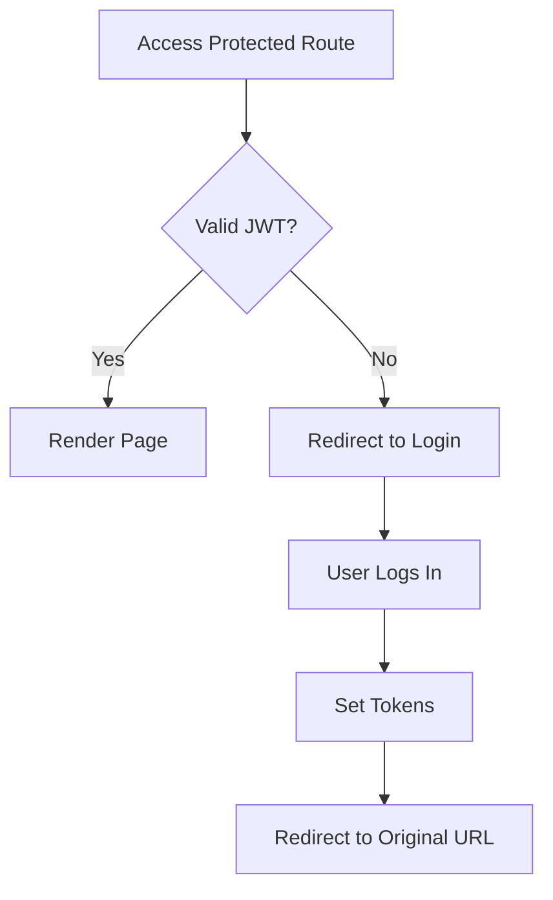

# Fitness Management Web Application — UI Plan

## Overview

This document defines the user interface strategy, design system, page layouts, component hierarchy, and UX flows for the Fitness Management Web Application.

**Design philosophy:** Clean, energetic, and approachable. The UI should feel motivating without being overwhelming — prioritizing clarity, progress visibility, and fast daily logging workflows.

---

## Design System

### Color Palette

| Token | Hex | Usage |
|-------|-----|-------|
| `--color-primary` | `#2563EB` | Primary actions, links, active nav |
| `--color-primary-hover` | `#1D4ED8` | Button hover states |
| `--color-secondary` | `#10B981` | Success, progress complete, nutrition |
| `--color-accent` | `#F59E0B` | Warnings, highlights, streaks |
| `--color-danger` | `#EF4444` | Errors, delete actions |
| `--color-background` | `#FFFFFF` | Page background (light mode) |
| `--color-surface` | `#F9FAFB` | Cards, elevated surfaces |
| `--color-border` | `#E5E7EB` | Dividers, input borders |
| `--color-text-primary` | `#111827` | Headings, body text |
| `--color-text-secondary` | `#6B7280` | Captions, labels, placeholders |
| `--color-text-inverse` | `#FFFFFF` | Text on primary buttons |

**Dark mode:** Deferred to post-MVP; CSS variables structured to support future theming.

### Typography

| Element | Font | Size | Weight |
|---------|------|------|--------|
| H1 | Geist Sans | 2.25rem (36px) | 700 |
| H2 | Geist Sans | 1.875rem (30px) | 600 |
| H3 | Geist Sans | 1.5rem (24px) | 600 |
| H4 | Geist Sans | 1.25rem (20px) | 600 |
| Body | Geist Sans | 1rem (16px) | 400 |
| Small | Geist Sans | 0.875rem (14px) | 400 |
| Caption | Geist Sans | 0.75rem (12px) | 400 |
| Mono | Geist Mono | 0.875rem | 400 |

**Line height:** 1.5 for body, 1.25 for headings

### Spacing Scale

Tailwind default scale: `1 = 4px`

| Token | Value | Usage |
|-------|-------|-------|
| `xs` | 4px | Tight inline spacing |
| `sm` | 8px | Icon gaps, compact padding |
| `md` | 16px | Standard padding |
| `lg` | 24px | Section spacing |
| `xl` | 32px | Page section gaps |
| `2xl` | 48px | Major section separation |

### Border Radius

| Token | Value | Usage |
|-------|-------|-------|
| `rounded-sm` | 4px | Badges, tags |
| `rounded-md` | 8px | Inputs, buttons |
| `rounded-lg` | 12px | Cards |
| `rounded-xl` | 16px | Modals, hero images |
| `rounded-full` | 9999px | Avatars, progress rings |

### Shadows

| Token | Usage |
|-------|-------|
| `shadow-sm` | Subtle card elevation |
| `shadow-md` | Dropdowns, popovers |
| `shadow-lg` | Modals, sticky headers |

---

## Component Library

### UI Primitives (`components/ui/`)

| Component | Variants | States |
|-----------|----------|--------|
| **Button** | primary, secondary, outline, ghost, danger | default, hover, active, disabled, loading |
| **Input** | text, email, password, number | default, focus, error, disabled |
| **Label** | — | required indicator |
| **Card** | default, interactive (hover lift) | — |
| **Badge** | difficulty (beginner/intermediate/advanced), status | — |
| **Modal** | sm, md, lg | open, closing |
| **Toast** | success, error, info | auto-dismiss 5s |
| **Skeleton** | text, card, circle | animated pulse |
| **Progress** | bar, ring | 0–100% with color thresholds |
| **Select** | single | default, focus, error |

### Layout Components

| Component | Description |
|-----------|-------------|
| **PublicHeader** | Logo, nav links (Programs), Login/Sign Up CTA |
| **PublicFooter** | Logo, links, copyright, social placeholders |
| **Sidebar** | Protected nav: Dashboard, Workouts, Nutrition, Goals, Profile |
| **MobileNav** | Hamburger → slide-out drawer with full nav |
| **PageHeader** | Page title, breadcrumbs, optional action button |

---

## Page Layouts

### Public Layout

```
┌────────────────────────────────────────────────────────────┐
│  [Logo]          Programs                    [Login] [CTA] │
├────────────────────────────────────────────────────────────┤
│                                                            │
│                      {children}                            │
│                                                            │
├────────────────────────────────────────────────────────────┤
│  Footer: Links | Social | © 2026                           │
└────────────────────────────────────────────────────────────┘
```

- Max content width: `1280px` (`max-w-7xl`)
- Horizontal padding: `px-4 md:px-6 lg:px-8`

### Protected Layout

```
┌──────────┬─────────────────────────────────────────────────┐
│          │  Page Header                          [Avatar]  │
│ Sidebar  ├─────────────────────────────────────────────────┤
│          │                                                 │
│ Dashboard│                  {children}                     │
│ Workouts │                                                 │
│ Nutrition│                                                 │
│ Goals    │                                                 │
│ Profile  │                                                 │
│          │                                                 │
│ [Logout] │                                                 │
└──────────┴─────────────────────────────────────────────────┘
     240px              flex-1
```

- Sidebar: fixed on desktop (`lg:`), hidden on mobile (hamburger)
- Content area: `p-6 lg:p-8`
- Mobile: bottom tab bar alternative (optional P2)

---

## Page Specifications

### 1. Home (`/`)

**Purpose:** Convert visitors to program browsers and sign-ups.

**Sections (top to bottom):**

1. **Hero**
   - Headline: "Transform Your Fitness Journey"
   - Subheadline: One-line value prop
   - CTAs: "Browse Programs" (primary), "Get Started" (secondary → login)
   - Hero image/illustration (right side on desktop)

2. **Featured Programs**
   - Section title: "Popular Programs"
   - 3 program cards in a row (grid on mobile)
   - "View All Programs" link

3. **Value Props**
   - 3 columns: Track Workouts | Monitor Nutrition | Achieve Goals
   - Icon + title + short description each

4. **Social Proof**
   - 2–3 testimonial cards (static content MVP)
   - Star ratings, quote, name

5. **Final CTA**
   - "Ready to start?" banner with enroll CTA

**Wireframe:**

```
┌─────────────────────────────────────────────────┐
│  HERO: Headline + CTA          [Illustration]   │
├─────────────────────────────────────────────────┤
│  Popular Programs                               │
│  [Card] [Card] [Card]                           │
├─────────────────────────────────────────────────┤
│  [Track]    [Nutrition]    [Goals]              │
├─────────────────────────────────────────────────┤
│  Testimonials                                   │
├─────────────────────────────────────────────────┤
│  CTA Banner                                     │
└─────────────────────────────────────────────────┘
```

---

### 2. Programs Catalog (`/programs`)

**Layout:** Full-width with sidebar filters (desktop) or top filter bar (mobile)

```
┌─────────────────────────────────────────────────┐
│  Programs                                       │
│  Find the perfect program for your goals        │
├──────────┬──────────────────────────────────────┤
│ Filters  │  [Card] [Card] [Card]                │
│          │  [Card] [Card] [Card]                │
│ Category │  [Card] [Card] [Card]                │
│ Difficulty                                      │
│ Sort     │  [Pagination]                        │
└──────────┴──────────────────────────────────────┘
```

**Program Card:**

```
┌─────────────────────┐
│  [Image 16:9]       │
│  ● Beginner         │
│  Strength Foundation│
│  8 weeks · $49.99   │
│  Short description..│
└─────────────────────┘
```

---

### 3. Program Details (`/programs/[slug]`)

**Layout:** Two-column on desktop (content + sticky sidebar)

```
┌─────────────────────────────────────────────────┐
│  [Hero Image]                                   │
│  Strength Foundation          ● Beginner        │
│  8 weeks · $49.99                               │
├──────────────────────────────┬──────────────────┤
│  Overview                    │  ┌─────────────┐ │
│  Lorem ipsum...              │  │ Enroll Now  │ │
│                              │  │ $49.99      │ │
│  What You'll Learn           │  └─────────────┘ │
│  • Item 1                    │  Includes:       │
│  • Item 2                    │  • 8 weeks       │
│                              │  • Workouts      │
│  Weekly Breakdown            │                  │
│  Week 1: ...                 │                  │
│                              │                  │
│  FAQ (accordion)             │                  │
└──────────────────────────────┴──────────────────┘
```

---

### 4. Login (`/login`)

**Layout:** Centered card, split screen optional (image left, form right on desktop)

```
┌─────────────────────────────────────────────────┐
│              ┌─────────────────┐                  │
│              │  Welcome Back   │                  │
│              │  Email          │                  │
│              │  Password       │                  │
│              │  [Login]        │                  │
│              │  ── or ──       │                  │
│              │  Create account │                  │
│              └─────────────────┘                  │
└─────────────────────────────────────────────────┘
```

- Tabs or toggle: Login | Register
- Register adds: first name, last name, confirm password
- Show validation errors inline below fields
- Redirect param preserved: `/login?redirect=/checkout?program=...`

---

### 5. Dashboard (`/dashboard`)

**Layout:** Grid of widgets

```
┌─────────────────────────────────────────────────┐
│  Welcome back, Maya!          Friday, Jul 17    │
├───────────────┬───────────────┬─────────────────┤
│ Today's       │ Nutrition     │ Active Goals    │
│ Workout       │ 1,450/2,000   │ Lose 5kg ████░  │
│ Upper Body    │ cal           │ Run 50km ██░░░  │
│ [Log Workout] │ [Log Meal]    │ [View Goals]    │
├───────────────┴───────────────┴─────────────────┤
│  My Programs                                    │
│  [Enrollment Card] [Enrollment Card]            │
├─────────────────────────────────────────────────┤
│  Recent Activity                                │
│  • Logged workout "HIIT Session" — 2h ago       │
│  • Logged lunch "Chicken Salad" — 5h ago        │
└─────────────────────────────────────────────────┘
```

**Empty state (new user):** Friendly illustration + "Get started by enrolling in a program" CTA

---

### 6. Checkout (`/checkout`)

```
┌─────────────────────────────────────────────────┐
│  Complete Enrollment                            │
├──────────────────────────────┬──────────────────┤
│  Order Summary               │  Your Info       │
│  ┌────────────────────────┐  │  Maya Smith      │
│  │ [img] Strength Found.  │  │  demo@fitness.app│
│  │ 8 weeks · $49.99       │  │                  │
│  └────────────────────────┘  │  ☑ I agree to    │
│                              │    terms         │
│  Total: $49.99               │  [Confirm]       │
└──────────────────────────────┴──────────────────┘
```

**Success state:** Checkmark animation → "You're enrolled!" → Redirect to dashboard (3s)

---

### 7. Workouts (`/workouts`)

**List view:**

```
┌─────────────────────────────────────────────────┐
│  Workouts                    [+ Log Workout]   │
├─────────────────────────────────────────────────┤
│  Today — Jul 17                                 │
│  ┌─────────────────────────────────────────┐    │
│  │ Upper Body Strength    45 min    [Edit] │    │
│  │ 5 exercises                             │    │
│  └─────────────────────────────────────────┘    │
│  Yesterday                                      │
│  ┌─────────────────────────────────────────┐    │
│  │ HIIT Cardio            30 min    [Edit] │    │
│  └─────────────────────────────────────────┘    │
└─────────────────────────────────────────────────┘
```

**Form view (`/workouts/new`):**

- Title, date picker, duration
- Dynamic exercise rows (add/remove)
- Each exercise: name, sets, reps, weight
- Save button (sticky footer on mobile)

---

### 8. Nutrition (`/nutrition`)

```
┌─────────────────────────────────────────────────┐
│  Nutrition           [< Jul 17, 2026 >]  [+ Meal]│
├───────────────┬───────────────┬─────────────────┤
│  Calories     │  Protein      │  Carbs    Fat   │
│  ◉ 1450/2000  │  95/150g      │  180g  45g      │
├───────────────┴───────────────┴─────────────────┤
│  Breakfast                                      │
│  Oatmeal with berries          350 cal    [···] │
│  Lunch                                          │
│  Chicken salad                 520 cal    [···] │
│  Snack                                          │
│  Protein shake                 180 cal    [···] │
└─────────────────────────────────────────────────┘
```

**Macro visualization:** Circular progress rings (Recharts or CSS conic-gradient)

---

### 9. Goals (`/goals`)

```
┌─────────────────────────────────────────────────┐
│  Goals                         [+ New Goal]     │
├─────────────────────────────────────────────────┤
│  Active Goals                                   │
│  ┌─────────────────────────────────────────┐    │
│  │ Lose 5kg                                │    │
│  │ 72 → 67 kg    ████████░░  60%           │    │
│  │ Due: Aug 17          [Log Progress]     │    │
│  └─────────────────────────────────────────┘    │
│  Completed                                      │
│  ┌─────────────────────────────────────────┐    │
│  │ ✓ Run 100km                   Completed │    │
│  └─────────────────────────────────────────┘    │
└─────────────────────────────────────────────────┘
```

**Goal detail (`/goals/[id]`):** Line chart of progress over time + log form

---

### 10. Profile (`/profile`)

**Layout:** Tabbed sections or vertical nav within page

| Section | Fields |
|---------|--------|
| Personal | Name, email (read-only), avatar URL |
| Body Metrics | Height, weight, age, gender, activity level |
| Nutrition Targets | Daily calories, protein, carbs, fat |
| Preferences | Units (metric/imperial), timezone |
| Security | Change password form |

---

## UX Flows

### Flow 1: Visitor → Enrolled Member



### Flow 2: Daily Logging



### Flow 3: Authentication



---

## Responsive Breakpoints

| Breakpoint | Width | Layout Changes |
|------------|-------|----------------|
| `sm` | 640px | 2-column grids |
| `md` | 768px | Sidebar filters visible |
| `lg` | 1024px | Protected sidebar visible; 3-column grids |
| `xl` | 1280px | Max content width applied |
| `2xl` | 1536px | Extra whitespace |

**Mobile-first approach:** Base styles for mobile; enhance at breakpoints.

---

## Interaction Patterns

| Pattern | Implementation |
|---------|----------------|
| Form submission | Disable button + spinner; toast on success/error |
| Destructive actions | Confirmation modal ("Delete workout?") |
| List empty states | Illustration + message + primary CTA |
| Loading | Skeleton placeholders matching content shape |
| Navigation | Active link highlighted in nav; page transitions via loading.tsx |
| Date selection | Native date input (MVP); date picker component (P2) |
| Charts | Recharts line chart for goal progress |

---

## Accessibility Checklist

- [ ] All interactive elements keyboard navigable
- [ ] Focus visible styles on buttons, links, inputs
- [ ] Form inputs have associated labels
- [ ] Error messages linked via `aria-describedby`
- [ ] Color contrast ratio ≥ 4.5:1 for text
- [ ] Images have alt text
- [ ] Modal traps focus and closes on Escape
- [ ] Skip to main content link
- [ ] Semantic HTML: `<main>`, `<nav>`, `<header>`, `<footer>`

---

## Iconography

Use **Lucide React** icons (consistent, MIT licensed):

| Context | Icon |
|---------|------|
| Dashboard | `LayoutDashboard` |
| Workouts | `Dumbbell` |
| Nutrition | `Apple` |
| Goals | `Target` |
| Profile | `User` |
| Logout | `LogOut` |
| Add | `Plus` |
| Edit | `Pencil` |
| Delete | `Trash2` |
| Success | `CheckCircle` |
| Error | `AlertCircle` |

---

## Animation Guidelines

| Element | Animation | Duration |
|---------|-----------|----------|
| Page transition | Fade in content | 150ms |
| Modal open | Scale + fade | 200ms |
| Toast enter | Slide up + fade | 200ms |
| Button loading | Spinner rotate | continuous |
| Progress bar | Width transition | 300ms ease |
| Card hover | Subtle lift (translateY -2px) | 150ms |

Keep animations subtle and respect `prefers-reduced-motion`.

---

## Asset Requirements

| Asset | Format | Size | Notes |
|-------|--------|------|-------|
| Logo | SVG | — | Wordmark + icon variant |
| Program thumbnails | JPG/WebP | 800×450 | 16:9 aspect ratio |
| Hero illustration | SVG/PNG | 600×400 | Home page |
| Empty state illustrations | SVG | 200×200 | Per feature area |
| Favicon | ICO/PNG | 32×32 | App icon |

MVP may use placeholder images from `/public/images/placeholders/`.

---

*Last updated: July 2026*
